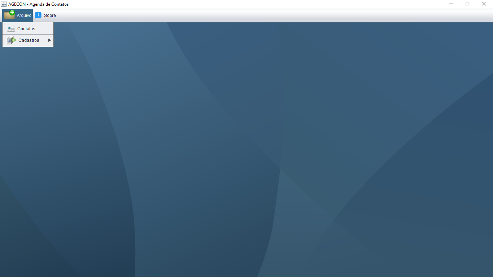
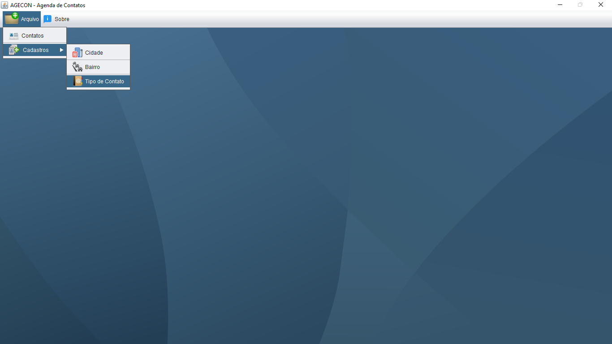
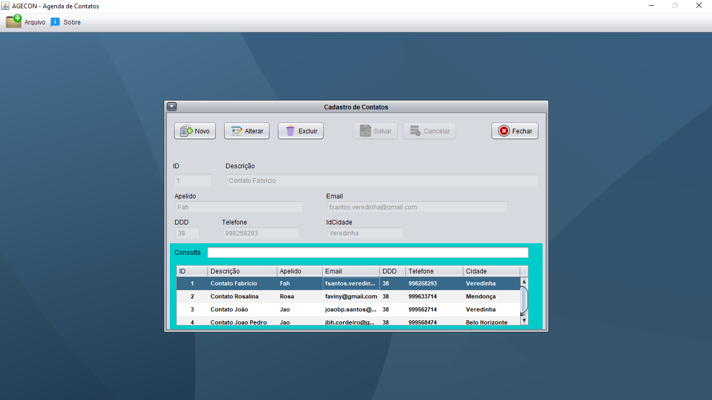

# AGENCON
👨‍🏫PROJETO CRIADO PARA O CURSO JAVA-SWING.

 <br>
 <br>
 <br>

## DESCRIÇÃO:
O aplicativo "AGENCON" (Cadastro de Contatos) é uma ferramenta útil para organizar e gerenciar seus contatos pessoais e profissionais. Ele permite que você armazene informações detalhadas sobre cada contato, incluindo nome, apelido, email, telefone, endereço e tipo de contato. O aplicativo também possui recursos de busca e filtro para que você possa encontrar rapidamente os contatos que precisa.

## FUNCIONALIDADES PRINCIPAIS:
* **Cadastro de novos contatos:** Adicione novos contatos à sua agenda com informações completas, incluindo nome, apelido, email, telefone, endereço e tipo de contato.
* **Edição de contatos:** Edite as informações de qualquer contato existente em sua agenda.
* **Exclusão de contatos:** Remova contatos que não sejam mais necessários da sua agenda.
* **Busca por contatos:** Encontre rapidamente os contatos que você precisa usando a pesquisa por nome, apelido, email, telefone ou endereço.
* **Filtro de contatos:** Filtre seus contatos por tipo de contato para visualizar apenas os contatos que você precisa.
* **Visualização de detalhes do contato:** Visualize todas as informações de um contato em uma única tela.
* **Exportação de contatos:** Exporte seus contatos para um arquivo CSV para que você possa importá-los para outro aplicativo ou sistema.

## EXECUTANDO O PROJETO:
1. **Configuração do Banco de Dados:**
   - Antes de executar o app, é necessário importar o arquivo `./DATABASE/DATABASE.sql para o seu banco de Dados Mysql.

2. **Configuração do PHP:**
   - Abra o arquivo `CODIGO\src\dao\ConexaoBanco.java` e ajuste as configurações do banco de dados:

     ```java
      private static final String driveClass = "com.mysql.cj.jdbc.Driver";
      private static final String url = "jdbc:mysql://localhost:3306/bancoAgendaContatos";
      private static final String user = "root";
      private static final String senha = "";
     ```

3. **Executando no NetBeans IDE:**
   1. **Inicie o NetBeans:**
      Abra o NetBeans IDE a partir do menu Iniciar (Windows) ou do lançador de aplicativos (macOS).

   2. **Navegue até o Projeto:**
      No menu superior, clique em "Arquivo" (ou "File" em inglês) e escolha "Abrir Projeto" (ou "Open Project").

   3. **Selecione o Diretório do Projeto:**
      Navegue até o diretório `CODIGO`, onde está localizado o projeto e selecione a pasta principal. Esta pasta contém o arquivo `pom.xml`.

   4. **Abra o Projeto:**
      Selecione a pasta do projeto e clique em "Abrir" (ou "Open" em inglês).

   5. **Aguarde a Abertura:**
      O NetBeans irá carregar o projeto. Isso pode levar alguns momentos, dependendo do tamanho do projeto e da velocidade do seu computador.

   6. **Projeto Aberto:**
      Uma vez que o projeto é carregado com sucesso, ele aparecerá no painel "Projetos" no canto esquerdo do IDE, e você poderá executa-lo clicando em `Run`.

## TECNOLOGIAS USADAS:
- [LINGUAGEM JAVA:](https://github.com/VILHALVA/CURSO-DE-JAVA) A linguagem de programação Java é amplamente utilizada para o desenvolvimento de aplicativos devido à sua portabilidade, segurança e robustez. Ela é uma escolha popular para desenvolver aplicativos desktop, web e móveis.

- [JAVA SWING:](https://github.com/VILHALVA/CURSO-DE-JAVA-SWING) Java Swing é um conjunto de bibliotecas gráficas para a criação de interfaces de usuário (UI) em Java. Ele fornece componentes gráficos avançados, como botões, caixas de texto, tabelas e muito mais, permitindo que os desenvolvedores criem aplicativos desktop com uma interface de usuário rica e interativa.

- [MYSQL:](https://github.com/VILHALVA/CURSO-DE-MYSQL) O MySQL é um sistema de gerenciamento de banco de dados relacional de código aberto que foi lançado pela primeira vez em 1995. Foi desenvolvido pela empresa sueca MySQL AB, fundada por Michael Widenius, David Axmark e Allan Larsson.

- [NETBEANS IDE:](https://netbeans.apache.org/download/index.html) O NetBeans IDE é um ambiente de desenvolvimento integrado gratuito e de código aberto para o desenvolvimento de aplicativos Java, bem como para várias outras linguagens de programação, como PHP, C/C++, e HTML5. Ele oferece uma série de recursos poderosos, como edição de código avançada, depuração, controle de versão e integração com servidores de aplicativos, facilitando o desenvolvimento de software em Java e outras plataformas.

## CREDITOS:
- [PROJETO CRIADO PARA O CURSO JAVA-SWING](https://github.com/VILHALVA/CURSO-DE-JAVA-SWING)
- [PROJETO FEITO PELO VILHALVA](https://github.com/VILHALVA)


